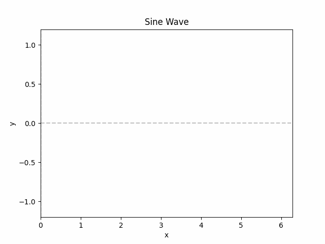
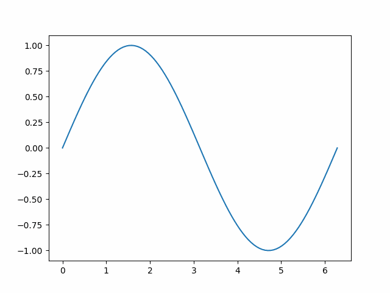

# Animated Plots

Animated plots are a great way to visualize data that changes over time. In this example, we will show you how to create an animated plot using the `matplotlib` library in Python.

## Method 1: Using `animate_plot` function

To create an animation, all you need is your x and y values and the `animate_plot` function from the `MecSimCalc` library. The `animate_plot` function takes in the x and y values, the duration of the animation in seconds, and the title of the plot

```python
import MecSimCalc as msc
import numpy as np

def main(inputs):
  # Define x and y values
  x = np.linspace(0, 2*np.pi, 100) # 100 points between 0 and 2π
  y = np.sin(x)

  # Create an animated plot
  plot = msc.animate_plot(x, y, title='Sine Wave', show_axes=True)

  return {'plot': plot}
```

### Output

The plot below shows a sine wave being drawn. The animation will run for 3 seconds.

<div style={{textAlign: 'center'}}>



</div>

There is a second style of animation that can be created using the `animate_plot` function. This style of animation is called `follow_tip`. The `follow_tip` animation style will animate the plot by moving a tip along the curve. The tip will move from the beginning of the curve to the end of the curve over the duration of the animation.

```python
import numpy as np
import mecsimcalc as msc

def main(inputs):
    x = np.linspace(0, 2*np.pi, 100) # 100 points between 0 and 2π
    y = np.sin(x)
    animation_html = msc.animate_plot(x, y, duration=4, title="Sine Wave", show_axes=True, follow_tip=True, fps=24)
    return {"animation": animation_html}
```

### Output

The plot below shows a sine wave that changes over time. The animation will run for 4 seconds.

<div style={{textAlign: 'center'}}>
.gif)
</div>

```python
{{outputs.plot}}
```

## Method 2: Using `print_animation` function

If you want to create an animated plot using the `matplotlib` library directly, you can use the `print_animation` function from the `MecSimCalc` library. The `print_animation` function takes in the FuncAnimation and returns the animation as an html string.

```python
import matplotlib.pyplot as plt
from matplotlib.animation import FuncAnimation
import numpy as np
import MecSimCalc as msc

def main(inputs):
  fig, ax = plt.subplots()
  x = np.linspace(0, 2*np.pi, 100)
  y = np.sin(x)
  line, = ax.plot(x, y)

  def update(frame): # This function will be called for each frame
    line.set_ydata(np.sin(x + frame / 10))
    return line,

  ani = FuncAnimation(fig, animate, frames = 100)
  animation = msc.print_animation(ani)

  return {'animation': animation}
```

### Output

The plot below shows a sine wave that changes over time. The animation will run for 5 seconds.

```python
{{outputs.animation}}
```

<div style={{textAlign: 'center'}}>



</div>
